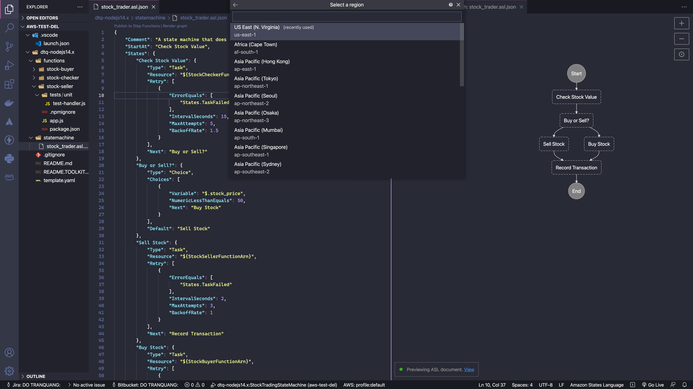

# aws-toolkit-sam-stepfunc-demo 🐳


[](https://github.com/tquangdo/aws-toolkit-sam-stepfunc-demo/issues/new)

## reference
[aws](https://docs.aws.amazon.com/toolkit-for-vscode/latest/userguide/welcome.html)

## toolkit layout


## SAM app: "lambda-nodejs14.x"
### 1) local
#### run CMD CLI
1. lambda
```shell
lambda-nodejs14.x$ sam local invoke
=>
Mounting /Users/NC00011462/Documents/GitHub/aws-toolkit-sam-demo/lambda-nodejs14.x/hello-world as /var/task:ro,delegated inside runtime container
{"statusCode":200,"body":"{\"message\":\"hello world\"}"}END RequestId: 5f4f75e1-f314-4820-8b10-9f95868ec0d7
REPORT RequestId: 5f4f75e1-f314-4820-8b10-9f95868ec0d7  Init Duration: 0.34 ms  Duration: 175.75 ms     Billed Duration: 176 ms Memory Size: 128 MB     Max Memory Used: 128 MB
```
2. API GW
- `lambda-nodejs14.x$ sam local start-api`
- access `http://127.0.0.1:3000/hello` on browser will show result
```json
{
  message: "hello world"
}
```
#### debug
- click `AWS: Edit debug configuration > Invoke` in `lambda-nodejs14.x/hello-world/app.js`

### 2) publish to AWS
- Ctrl+P -> type `>deploy` -> select `Deploy SAM app`

## STEP FUNCTION app: "dtq-nodejs14.x"
### 1) local
#### run
```shell
dtq-nodejs14.x$ sam local invoke StockCheckerFunction
=>
Mounting /Users/NC00011462/Documents/GitHub/aws-test-del/dtq-nodejs14.x/functions/stock-checker as /var/task:ro,delegated inside runtime container
{"stock_price":5}END RequestId: a5e923cf-6447-463b-97f1-fd257da8e0dc
REPORT RequestId: a5e923cf-6447-463b-97f1-fd257da8e0dc  Init Duration: 0.26 ms  Duration: 180.12 ms     Billed Duration: 181 ms Memory Size: 128 MB     Max Memory Used: 128 MB
```
#### create step function's json
- Ctrl + P -> type `>step function` -> select `create new step function`
- choose tempate `Hello world`, ..., `Choice state`
- select `json` OR `yaml`
- will ouput *.json OR *.yaml file
- click `render graph`, for example in `dtq-nodejs14.x/statemachine/stock_trader.asl.json`

### 2) publish to AWS
- click `publish to step function`, for example in `dtq-nodejs14.x/statemachine/stock_trader.asl.json`

